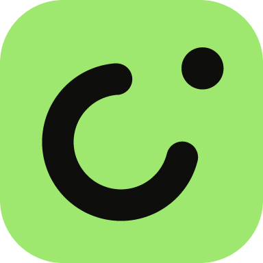

# Forma — FinTech UI Kit

A complete consumer-banking app built in Jetpack Compose, on top of the
[FormaUI](https://github.com/devsnackio/forma-ui) design system. Twenty-five destinations, a working
money model, and no dead buttons.

It exists to answer a question a component gallery can't: *what does a design system look like once
it has to carry a whole product?* Every screen here is reachable, every control does something, and
the numbers on one screen agree with the numbers on the next.

---

## Screens

| Home | Activity | Transaction | Card |
|:---:|:---:|:---:|:---:|
| 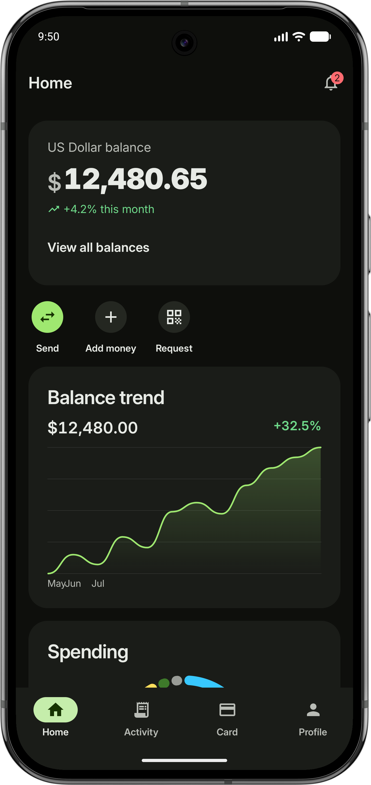 | 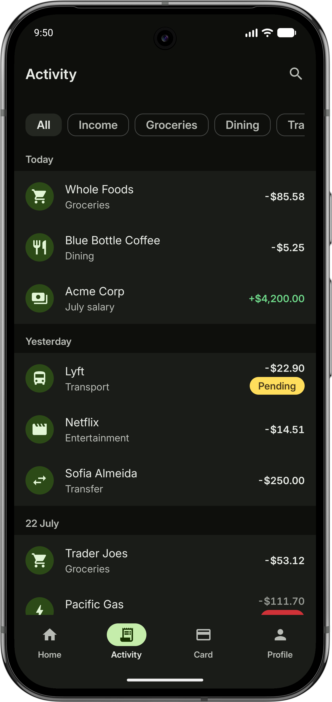 | 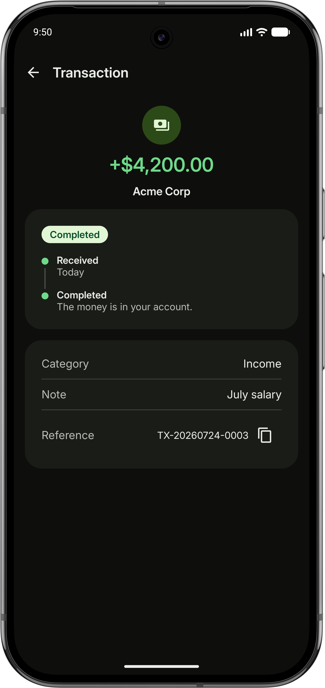 | 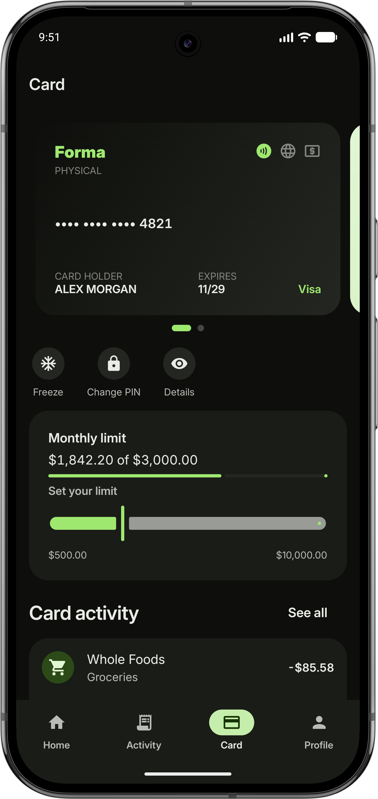 |

| Card details | Profile | Statements | Notifications |
|:---:|:---:|:---:|:---:|
| 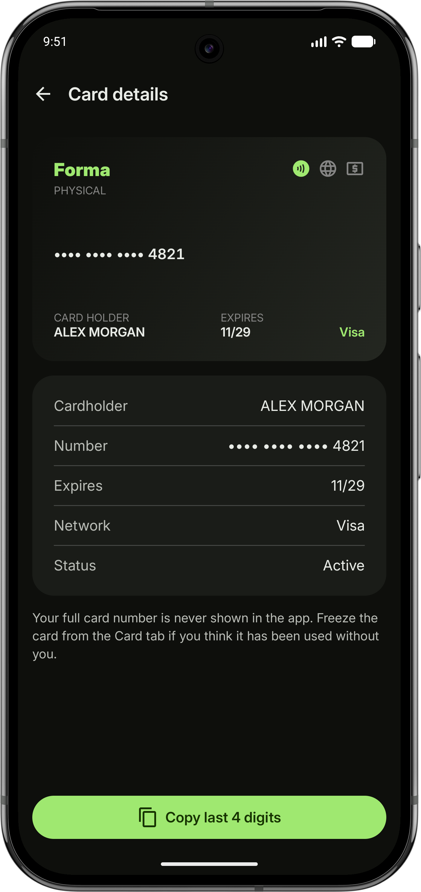 | 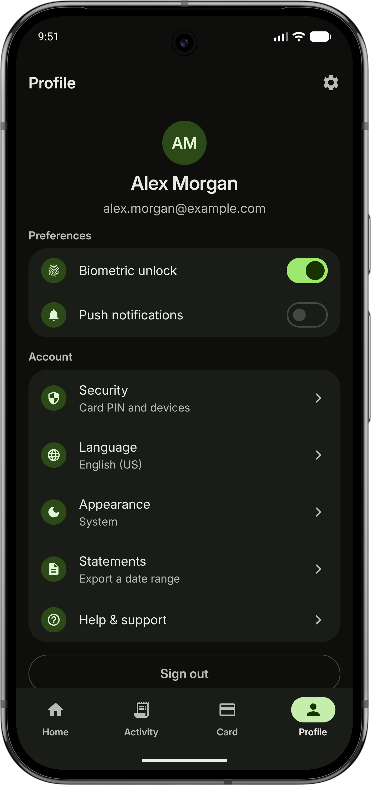 | 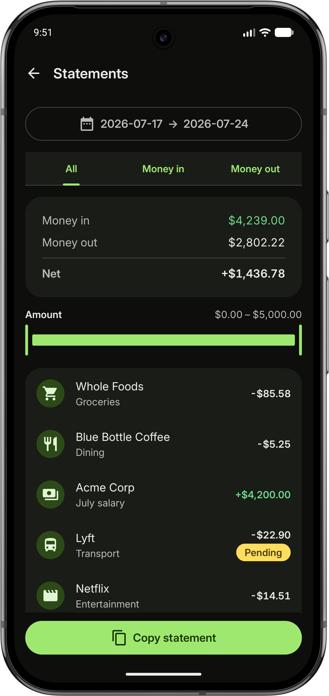 | 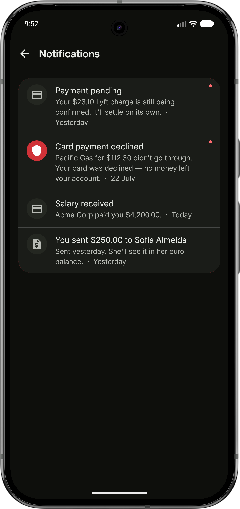 |

The send flow, end to end — amount and currency pair, payee, review sheet, completion:

| Send money | Choose recipient | Review transfer | Sent |
|:---:|:---:|:---:|:---:|
| 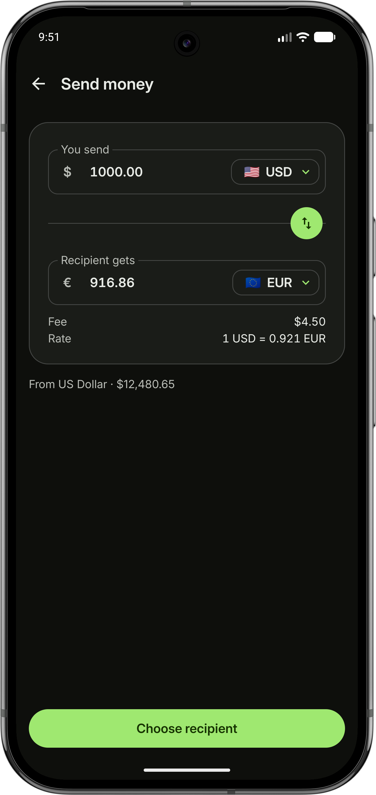 | 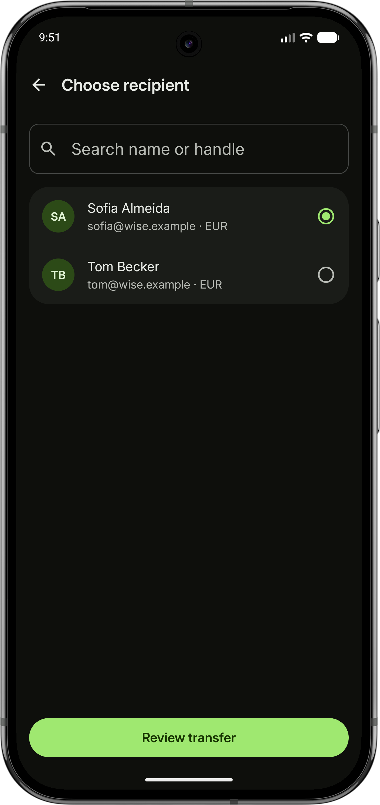 | 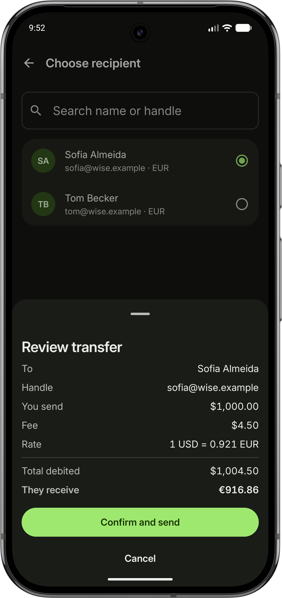 | 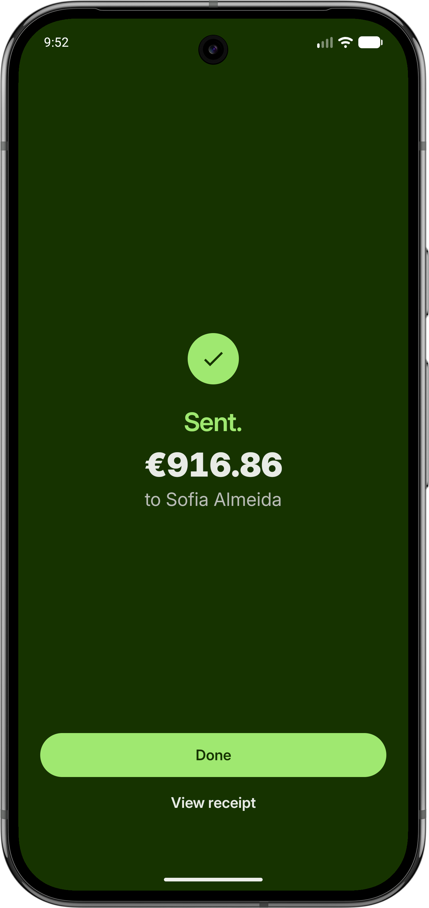 |

Requesting money is the mirror image, and the one flow that deliberately does *not* touch a balance
— it files a pending row and waits:

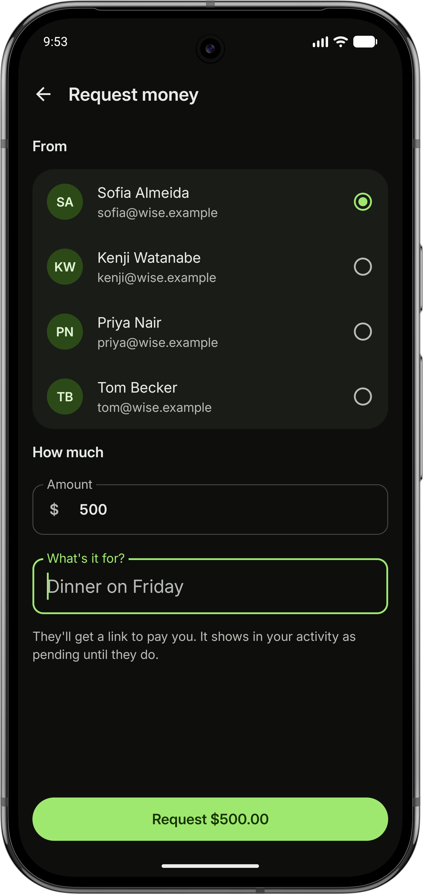

Plus **Add money**, **Get paid**, **Accounts**, **Change PIN**, **Security**, **Help**, and a
pre-session flow of Welcome, Onboarding, Sign in, Sign up, PIN entry, Forgot password and Terms.

Captured in dark. Every screen is built from theme tokens and renders in light too — Profile →
Appearance switches between light, dark and system. The one exception is the completion screen
above, which holds its deep-green polarity in both.

---

## Running it

```bash
./gradlew :app:installDebug              # build and install on a device or emulator
./gradlew :app:testDebugUnitTest         # JVM tests — money, statements, grouping, chart slices
./gradlew :app:connectedDebugAndroidTest # Compose UI tests, one suite per screen
```

Requires JDK 17 or newer. Everything else — Gradle 9.5.0, the SDK bits — comes from the wrapper and
the version catalog. `minSdk` is 24; `java.time` is backported by core library desugaring so
transactions can use `LocalDate` instead of `Calendar`.

The app opens on Welcome the first time and on the Dashboard afterwards, because `SessionStore`
persists one flag. **The demo PIN is `123456`** (`MainActivity.DemoPin`) — it lives client-side
purely so the wrong-PIN error state is reachable in a showcase. Sign out from Profile to replay the
onboarding flow.

---

## Stack

| | |
|---|---|
| Kotlin | 2.4.10 |
| Compose | BOM 2026.08.00 (Material 3) |
| FormaUI | `dev.formaui:core` + `dev.formaui:components` 0.2.0 |
| Navigation | `navigation-compose` 2.9.8, type-safe routes |
| Build | AGP 9.3.1, Gradle 9.5.0, compile/target SDK 37 |

One module, `:app`. No DI framework, no networking, no database — the demo's state is a set of
`remember`ed values in one composable, which for a UI kit keeps the wiring legible.

---

## Layout

```
dev.formaui.fintechuikit
├── MainActivity.kt      the whole navigation graph, and every piece of demo state
├── SessionStore.kt      the one persisted flag: has setup been completed
├── navigation/          Destination routes, the Scaffold shell, the bottom bar
├── screens/             one file per screen — all stateless, all with @Preview
├── components/          reusable pieces, grouped by what they are about
│   ├── amount/ auth/ balance/ chart/ common/
│   └── converter/ onboarding/ paymentcard/ status/ transaction/
├── data/                the money rules — pure Kotlin, no Compose types
│   └── model/           Money, Currency, Account, Transaction, ExchangeRate, Notification
└── ui/theme/            brand tokens, spacing, type, shape, motion
```

## How it fits together

**State is hoisted to exactly one place.** `FinTechApp` in `MainActivity.kt` owns the accounts, the
activity list, the wallet, the inbox and every form field. Screens take values and callbacks and
nothing else, which is what makes all 120-odd `@Preview`s render without a device and the screen
tests run without a navigator. A real app would put ViewModels here; the trade is deliberate.

**The money model is shared, not duplicated.** A confirmed transfer debits `accounts` and prepends
to `activity`, so the Dashboard balance, the Activity list, the spending donut and the statement
export are all reading the same state. `data/MoneyMovement.kt` is the only place that decides the
*sign* of an amount, because four different components colour themselves from it.

**Routes are type-safe.** Destinations are `@Serializable` objects, so navigating is a compile-checked
reference rather than a string. Only one route carries an argument — a transaction id, not the
transaction, so the back stack holds something that stays valid when the list changes underneath it.

**Motion is decided by the pair of screens, not per route.** `screenMotion` in `FinTechNavHost.kt`
classifies each leg — tab-to-tab fades, a detail rises, an arrival scales in, a flow step slides —
so a new screen inherits the right transition from its kind. Screens don't add their own; nested
alphas multiply rather than add, and that reads as lag.

**Reduced motion is honoured.** `LocalReducedMotion` reaches the chart animations and the success
badge, which a NavHost-level switch can't.

---

## Design

[`DESIGN.md`](docs/DESIGN.md) is the source of truth for colour, type, spacing, shape and component
rules. `ui/theme/` is that document expressed as tokens, and where the app departs from it — the
success screen's polarity flip, the chart palette that excludes the CTA green — the code says why.

The mark at the top of this file is the app's own — an open ring with the dot already leaving it, a
value moving out of a balance. It is monochrome in one of two polarities, ink on the CTA green or
green on ink, and introduces no colour the palette didn't already have. It ships as the launcher
icon (`res/drawable/ic_launcher_foreground.xml`, over an ink background) and as the lockup in
`components/common/BrandLockup.kt`, which drops the dot below 32dp because at that size it fuses
with the ring stroke.

The visual language is modeled on the public brand of **Wise**, as a design study. Forma is a
fictional product, and this project is not affiliated with or endorsed by Wise.

## Conventions

Comments explain **why**, not what. If a value is load-bearing — a stroke width that keeps small
donut slices from collapsing, a `popUpTo` target that keeps the bottom bar working — the reasoning
sits next to it, because that is the thing a future reader cannot recover from the code.

Numbers in the app come from `data/SampleData.kt`. There is no pull-to-refresh, no fake spinner and
no button that does nothing; where a feature can't be honestly demonstrated it is left out rather
than mocked up.

---

## License

Licensed under the [Apache License 2.0](LICENSE), the same as FormaUI itself. The licence covers
this code; it grants no rights in anyone's trademarks (Apache-2.0 §6), and the brand this study is
modeled on is Wise's.
